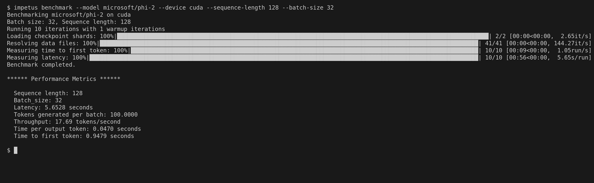
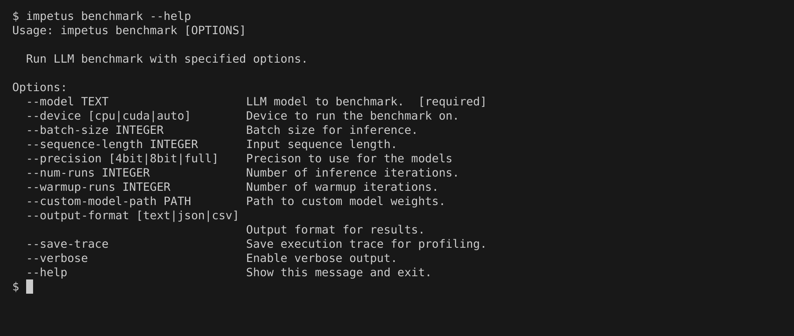

<!-- Improved compatibility of back to top link: See: https://github.com/dhmnr/impetus/pull/73 -->
<a id="readme-top"></a>
<!--
*** Thanks for checking out the Best-README-Template. If you have a suggestion
*** that would make this better, please fork the repo and create a pull request
*** or simply open an issue with the tag "enhancement".
*** Don't forget to give the project a star!
*** Thanks again! Now go create something AMAZING! :D
-->


<!-- PROJECT SHIELDS -->
<!--
*** I'm using markdown "reference style" links for readability.
*** Reference links are enclosed in brackets [ ] instead of parentheses ( ).
*** See the bottom of this document for the declaration of the reference variables
*** for contributors-url, forks-url, etc. This is an optional, concise syntax you may use.
*** https://www.markdownguide.org/basic-syntax/#reference-style-links
-->
[![Contributors][contributors-shield]][contributors-url]
[![Forks][forks-shield]][forks-url]
[![Stargazers][stars-shield]][stars-url]
[![Issues][issues-shield]][issues-url]
[![MIT License][license-shield]][license-url]
<!-- [![LinkedIn][linkedin-shield]][linkedin-url] -->


<!-- PROJECT LOGO -->
<br />
<div align="center">
  <a href="https://github.com/dhmnr/impetus">
    
  </a>

  <h3 align="center">Impetus</h3>

  <p align="center">
    An awesome tool/library benchmark LLM performance on all kinds of hardware!
    <br />
    <a href="https://github.com/dhmnr/impetus"><strong>Explore the docs »</strong></a>
    <br />
    <br />
    <a href="https://github.com/dhmnr/impetus">View Demo</a>
    ·
    <a href="https://github.com/dhmnr/impetus/issues/new?labels=bug&template=bug-report---.md">Report Bug</a>
    ·
    <a href="https://github.com/dhmnr/impetus/issues/new?labels=enhancement&template=feature-request---.md">Request Feature</a>
  </p>
</div>


<!-- TABLE OF CONTENTS -->
<details>
  <summary>Table of Contents</summary>
  <ol>
    <li>
      <a href="#about-the-project">About The Project</a>
      <ul>
        <li><a href="#built-with">Built With</a></li>
      </ul>
    </li>
    <li>
      <a href="#getting-started">Getting Started</a>
      <ul>
        <li><a href="#prerequisites">Prerequisites</a></li>
        <li><a href="#installation">Installation</a></li>
      </ul>
    </li>
    <li><a href="#usage">Usage</a></li>
    <li><a href="#roadmap">Roadmap</a></li>
    <li><a href="#contributing">Contributing</a></li>
    <li><a href="#license">License</a></li>
    <li><a href="#contact">Contact</a></li>
    <li><a href="#acknowledgments">Acknowledgments</a></li>
  </ol>
</details>


<!-- ABOUT THE PROJECT -->
## About The Project



<p align="right">(<a href="#readme-top">back to top</a>)</p>


<!-- GETTING STARTED -->
## Getting Started

### Installation

Installation with pip is simple as follows:
```sh
pip install impetus
```

### Usage



_For more examples, please refer to the [Documentation](https://example.com)_

## Developing locally

This project use poetry for dependency management, and is required for running impetus locally. 


1. Clone the repo
   ```sh
   git clone https://github.com/dhmnr/impetus.git
   ```
2. Install Dependencies
   ```sh
   poetry install
   ```
3. Run the command as follows
   ```sh
   poetry shell run impetus --help
   ```


<p align="right">(<a href="#readme-top">back to top</a>)</p>


<!-- ROADMAP -->
## Roadmap

- [X] Support Quantization
- [ ] Multiple GPU support with accelerate
- [ ] GPU/CPU usage information
- [ ] Flops/MFU information
- [ ] Detailed breakdown, | self-attention | FFN | lm_head 
- [ ] Support BERT and VLMs and others
- [ ] Support different backends

## Minor Fixes
- [ ] Support different datasets

See the [open issues](https://github.com/dhmnr/impetus/issues) for a full list of proposed features (and known issues).

<p align="right">(<a href="#readme-top">back to top</a>)</p>


<!-- CONTRIBUTING -->
## Contributing

Contributions are what make the open source community such an amazing place to learn, inspire, and create. Any contributions you make are **greatly appreciated**.

If you have a suggestion that would make this better, please fork the repo and create a pull request. You can also simply open an issue with the tag "enhancement".
Don't forget to give the project a star! Thanks again!

1. Fork the Project
2. Create your Feature Branch (`git checkout -b feature/AmazingFeature`)
3. Commit your Changes (`git commit -m 'Add some AmazingFeature'`)
4. Push to the Branch (`git push origin feature/AmazingFeature`)
5. Open a Pull Request

### Top contributors:

<a href="https://github.com/dhmnr/impetus/graphs/contributors">
  
</a>

<p align="right">(<a href="#readme-top">back to top</a>)</p>


<!-- LICENSE -->
## License

Distributed under the MIT License. See `LICENSE` for more information.

<p align="right">(<a href="#readme-top">back to top</a>)</p>


<!-- CONTACT -->
## Contact

<!-- Your Name - [@your_twitter](https://twitter.com/your_username) - email@example.com -->

Project Link: [https://github.com/dhmnr/impetus](https://github.com/dhmnr/impetus)

<p align="right">(<a href="#readme-top">back to top</a>)</p>


<!-- ACKNOWLEDGMENTS -->
## Acknowledgments

Use this space to list resources you find helpful and would like to give credit to. I've included a few of my favorites to kick things off!

* [Choose an Open Source License](https://choosealicense.com)
* [Img Shields](https://shields.io)
* [GitHub Pages](https://pages.github.com)

<p align="right">(<a href="#readme-top">back to top</a>)</p>


<!-- MARKDOWN LINKS & IMAGES -->
<!-- https://www.markdownguide.org/basic-syntax/#reference-style-links -->
[contributors-shield]: https://img.shields.io/github/contributors/dhmnr/impetus.svg?style=for-the-badge
[contributors-url]: https://github.com/dhmnr/impetus/graphs/contributors
[forks-shield]: https://img.shields.io/github/forks/dhmnr/impetus.svg?style=for-the-badge
[forks-url]: https://github.com/dhmnr/impetus/network/members
[stars-shield]: https://img.shields.io/github/stars/dhmnr/impetus.svg?style=for-the-badge
[stars-url]: https://github.com/dhmnr/impetus/stargazers
[issues-shield]: https://img.shields.io/github/issues/dhmnr/impetus.svg?style=for-the-badge
[issues-url]: https://github.com/dhmnr/impetus/issues
[license-shield]: https://img.shields.io/github/license/dhmnr/impetus.svg?style=for-the-badge
[license-url]: https://github.com/dhmnr/impetus/blob/master/LICENSE.txt
[linkedin-shield]: https://img.shields.io/badge/-LinkedIn-black.svg?style=for-the-badge&logo=linkedin&colorB=555
[linkedin-url]: https://linkedin.com/in/othneildrew
[product-screenshot]: images/screenshot.png
<!-- [Next.js]: https://img.shields.io/badge/next.js-000000?style=for-the-badge&logo=nextdotjs&logoColor=white
[Next-url]: https://nextjs.org/ -->

